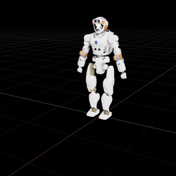

# val_asset
This repo holds USD file of Valkyrie robot. The original URDF can be found [here](https://github.com/ihmcrobotics/valkyrie/tree/main/src/main/resources/models/val_description). A minor modification has been applied which includes fixing the neck joints as they are not crucial for bipedal walking.

  

## Credits
- Johnson Space Center - ER4 - Valkyrie Team
- IHMC humanoids group
- Maurice Fallon and his group
- Open Source Robotics Foundation(OSRF)

## License
License NASA 1.3